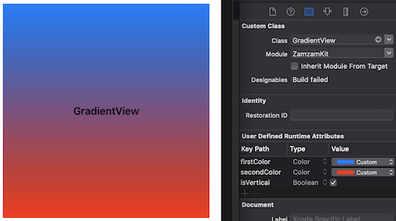
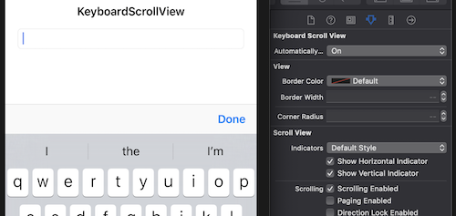
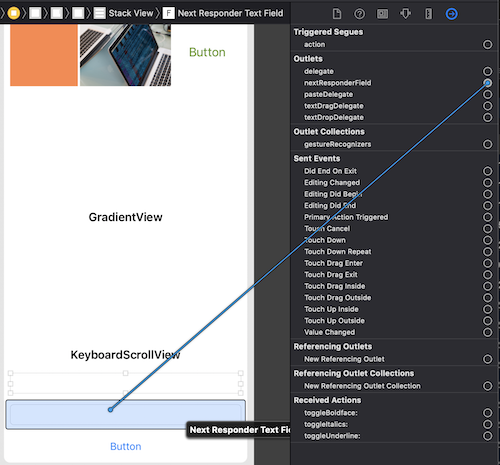
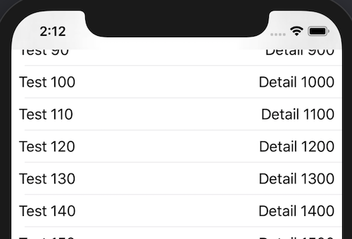
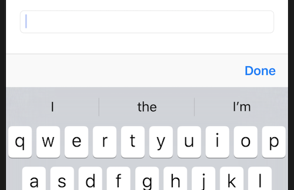
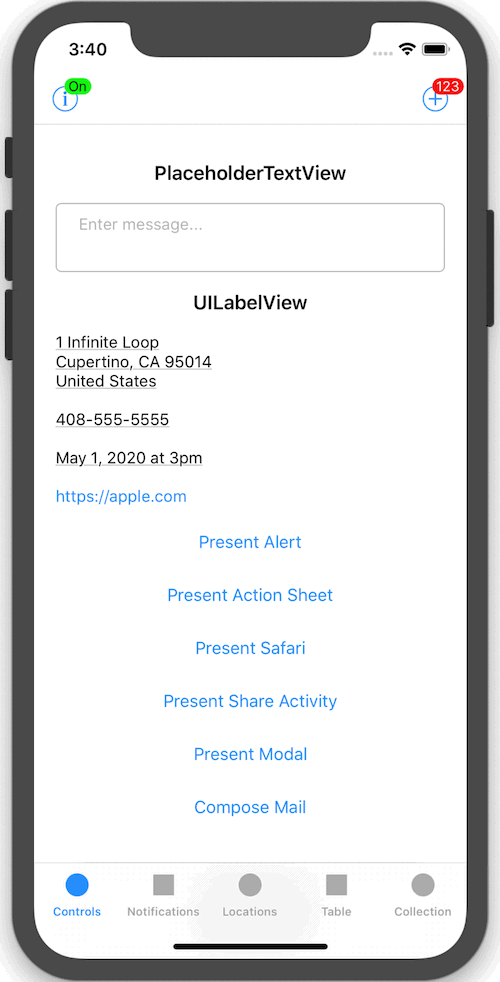
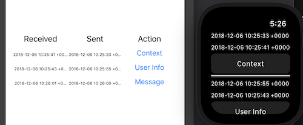

# ZamzamKit

[](https://travis-ci.org/ZamzamInc/ZamzamKit)
[](https://github.com/ZamzamInc/ZamzamKit)
[](https://swift.org)
[](https://developer.apple.com/xcode)
[](https://github.com/Carthage/Carthage)
[](http://cocoapods.org/pods/ZamzamKit)
[](https://opensource.org/licenses/MIT)

ZamzamKit a Swift framework for rapid development using a collection of small utility extensions for Standard Library, Foundation and UIKit classes and protocols.

## Installation

<details>
<summary>Carthage</summary>

Add `github "ZamzamInc/ZamzamKit"` to your `Cartfile`.
</details>

<details>
<summary>CocoaPods</summary>

Add `pod "ZamzamKit"` to your `Podfile`.
</details>

<details>
<summary>Framework</summary>

1. Download the latest release of `ZamzamKit` and extract the zip.
2. Go to your Xcode project’s "General" settings. Drag ZamzamKit.framework and ZamzamKit.framework from the appropriate Swift-versioned directory for your project in `ios/`, `tvos/` or `watchos/` directory to the "Embedded Binaries" section. Make sure "Copy items if needed" is selected (except if using on multiple platforms in your project) and click Finish.
3. In your unit test target's "Build Settings", add the parent path to ZamzamKit.framework in the "Framework Search Paths" section.
</details>

## Usage

### Standard Library

<details>
<summary>Array</summary>

> Safely retrieve an element at the given index if it exists:
```swift
// Before
if let items = tabBarController.tabBar.items, items.count > 4 {
    items[3].selectedImage = UIImage("my-image")
}
```
```swift
// After
tabBarController.tabBar.items?.get(3)?.selectedImage = UIImage("my-image")

[1, 3, 5, 7, 9].get(1) -> Optional(3)
[1, 3, 5, 7, 9].get(12) -> nil
```

> Get distinct elements from an array:
```swift
[1, 1, 3, 3, 5, 5, 7, 9, 9].distinct -> [1, 3, 5, 7, 9]
```

> Remove an element from an array by the value:
```swift
var array = ["a", "b", "c", "d", "e"]
array.remove("c")
array -> ["a", "b", "d", "e"]
```

> Easily get the array version of an array slice:
```swift
["a", "b", "c", "d", "e"].prefix(3).array
```
</details>

<details>
<summary>Dictionary</summary>

> Remove all values equal to nil:
```swift
var value: [String: Any?] = [
    "abc": 123,
    "efd": "xyz",
    "ghi": nil,
    "lmm": true,
    "qrs": nil,
    "tuv": 987
]

value.removeAllNils()

value.count -> 4
value.keys.contains("abc") -> true
value.keys.contains("ghi") -> false
value.keys.contains("qrs") -> false
```
</details>

<details>
<summary>Equatable</summary>

> Determine if a value is contained within the array of values:
```swift
"b".within(["a", "b", "c"]) -> true

let status: OrderStatus = .cancelled
status.within([.requeseted, .accepted, .inProgress]) -> false
```
</details>

<details>
<summary>Number</summary>

> Round doubles, floats, or any floating-point type:
```swift
123.12312421.rounded(toPlaces: 3) -> 123.123
Double.pi.rounded(toPlaces: 2) -> 3.14
```
</details>

<details>
<summary>String</summary>

> Create a new random string of given length:
```swift
String(random: 10) -> "zXWG4hSgL9"
String(random: 4, prefix: "PIN-") -> "PIN-uSjm"
```

> Safely use subscript indexes and ranges on strings:
```swift
let value = "Abcdef123456"
value[3] -> "d"
value[3..<6] -> "def"
value[3...6] -> "def1"
value[3...] -> "def123456"
value[3...99] -> nil
value[99] -> nil
```

> Validate string against common formats:
```swift
"test@example.com".isEmail -> true
"123456789".isNumber -> true
"zamzam".isAlpha -> true
"zamzam123".isAlphaNumeric -> true
```

> Remove spaces or new lines from both ends:
```swift
" Abcdef123456 \n\r  ".trimmed -> "Abcdef123456"
```

> Truncate to a given number of characters:
```swift
"Abcdef123456".truncated(3) -> "Abc..."
"Abcdef123456".truncated(6, trailing: "***") -> "Abcdef***"
```

> Determine if a given value is contained:
```swift
"1234567890".contains("567") -> true
"abc123xyz".contains("ghi") -> false
```

> Injects a separator every nth characters:
```swift
"1234567890".separate(every: 2, with: "-") -> "12-34-56-78-90"
```

> Match using a regular expression pattern:
```swift
"1234567890".match(regex: "^[0-9]+?$") -> true
"abc123xyz".match(regex: "^[A-Za-z]+$") -> false
```

> Replace occurrences of a regular expression pattern:
```swift
"aa1bb22cc3d888d4ee5".replacing(regex: "\\d", with: "*") -> "aa*bb**cc*d***d*ee*"
```

> Remove HTML for plain text:
```swift
"<p>This is <em>web</em> content with a <a href=\"http://example.com\">link</a>.</p>".htmlStripped -> "This is web content with a link."
```

> Encoders and decoders:
```swift
value.urlEncoded
value.urlDecoded
value.htmlDecoded
value.base64Encoded
value.base64Decoded
value.base64URLEncoded
```

> Easily get the string version of substring:
```swift
"hello world".prefix(5).string
```

> Determine if an optional string is `nil` or has no characters
```swift
var value: String? = "test 123"
value.isNilOrEmpty
```

> Convert sequences and dictionaries to a JSON string:
```swift
// Before
guard let data = self as? [[String: Any]],
    let stringData = try? JSONSerialization.data(withJSONObject: data, options: []) else {
        return nil
}
    
let json = String(data: stringData, encoding: .utf8) as? String
```
```swift
// After
let json = mySequence.jsonString
let json = myDictionary.jsonString
```
</details>

### Foundation

<details>
<summary>Bundle</summary>

> Get the contents of a file within any bundle:
```swift
Bundle.main.string(file: "Test.txt") -> "This is a test. Abc 123.\n"
```

> Get the contents of a property list file within any bundle:
```swift
let values = Bundle.main.string(plist: "Settings.plist")
values["MyString1"] as? String -> "My string value 1."
values["MyNumber1"] as? Int -> 123
values["MyBool1"] as? Bool -> false
values["MyDate1"] as? Date -> 2018-11-21 15:40:03 +0000
```
</details>

<details>
<summary>Color</summary>

> Additional color initializers:
```swift
UIColor(hex: 0x990000)
UIColor(hex: 0x4286F4)
UIColor(rgb: (66, 134, 244))
```
</details>

<details>
<summary>Currency</summary>

> A formatter that converts between numeric values and their textual currency representations:
```swift
let formatter = CurrencyFormatter()
formatter.string(fromAmount: 123456789.987) -> "$123,456,789.99"

let formatter2 = CurrencyFormatter(for: Locale(identifier: "fr-FR"))
formatter2.string(fromCents: 123456789) -> "1 234 567,89 €"
```
</details>

<details>
<summary>Date</summary>

> Determine if a date is in the past or future:
```swift
Date(timeIntervalSinceNow: -100).isPast -> true
Date(timeIntervalSinceNow: 100).isPast -> false

Date(timeIntervalSinceNow: 100).isFuture -> true
Date(timeIntervalSinceNow: -100).isFuture -> false
```

> Determine if a date is today, yesterday, or tomorrow:
```swift
Date().isToday -> true
Date(timeIntervalSinceNow: -90_000).isYesterday -> true
Date(timeIntervalSinceNow: 90_000).isTomorrow -> true
```

> Determine if a date is within a weekday or weekend period:
```swift
Date().isWeekday -> false
Date().isWeekend -> true
```

> Get the beginning or end of the day:
```swift
Date().startOfDay -> "2018/11/21 00:00:00"
Date().endOfDay -> "2018/11/21 23:59:59"
```

> Get the beginning or end of the month:
```swift
Date().startOfMonth -> "2018/11/01 00:00:00"
Date().endOfMonth -> "2018/11/30 23:59:59"
```

> Determine if a date is between two other dates:
```swift
let date = Date()
let date1 = Date(timeIntervalSinceNow: 1000)
let date2 = Date(timeIntervalSinceNow: -1000)

date.isBetween(date1, date2) -> true
```

> Determine if a date is beyond a specified time window:
```swift
let date = Date(fromString: "2018/03/22 09:40")
let fromDate = Date(fromString: "2018/03/22 09:30")

date.isBeyond(fromDate, bySeconds: 300) -> true
date.isBeyond(fromDate, bySeconds: 1200) -> false
```

> Create a date from a string:
```swift
Date(fromString: "2018/11/01 18:15")
Date(fromString: "1440/03/01 18:31", calendar: Calendar(identifier: .islamic))
```

> Format a date to a string:
```swift
Date().string(format: "MMM d, h:mm a") -> "Jan 3, 8:43 PM"
Date().string(style: .full, calendar: Calendar(identifier: .hebrew)) -> "Friday, 1 Kislev 5779"
```

> Format a time interval to display as a timer.
```swift
let date = Date(fromString: "2016/03/22 09:45")
let fromDate = Date(fromString: "2016/03/22 09:40")

date.timerString(from: fromDate)

// Prints "00:05:00"
```

> Get the decimal representation of the time:
```swift
Date(fromString: "2018/10/23 18:15").timeToDecimal -> 18.25
```

> Increment years, months, days, hours, or minutes:
```swift
let date = Date()
date + .years(1)
date + .months(2)
date - .days(4)
date - .hours(6)
date + .minutes(12)
date + .days(5, Calendar(identifier: .chinese))
```

> Convert between time interval units:
```swift
let diff = date.timeIntervalSince(date2) -> 172,800 seconds
diff.minutes -> 2,800 minutes
diff.hours -> 48 hours
diff.days -> 2 days
```

> Time zone context and offset:
```swift
let timeZone = TimeZone(identifier: "Europe/Paris")
timeZone?.isCurrent -> false
timeZone?.offsetFromCurrent -> -21600
```

> Normalize date calculations and data storage using `UTC` and `POSIX`:
```swift
let calendar: Calendar = .posix
let locale: Locale = .posix
```
</details>

<details>
<summary>FileManager</summary>

> Get URL or file system path for a file:
```swift
FileManager.default.url(of: fileName, from: .documentDirectory)
FileManager.default.path(of: fileName, from: .cachesDirectory)
```

> Get URL or file system paths of files within a directory:
```swift
FileManager.default.urls(from: .documentDirectory)
FileManager.default.paths(from: .downloadsDirectory)
```

> Retrieve a file remotely and persist to local disk:
```swift
FileManager.default.download(from: "http://example.com/test.pdf") { url, response, error in
    // The `url` parameter represents location on local disk where remote file was downloaded.
}
```
</details>

<details>
<summary>Infix</summary>

> Assign a value if not nil:
```swift
var test: Int? = 123
var value: Int? = nil

test ?= value
// test == 123

value = 456
test ?= value
// test == 456
```
</details>

<details>
<summary>NotificationCenter</summary>

> Shorthand to post and observer functions:
```swift
let notificationCenter: NotificationCenter = .default

// Before
notificationCenter.post(name: .MyCustomNotificationKey, object: nil, userInfo: nil)
notificationCenter.addObserver(self, selector: #selector(willEnterForeground), name: UIApplication.willEnterForegroundNotification, object: nil)
notificationCenter.removeObserver(self, name: UIApplication.willEnterForegroundNotification, object: nil)

// After
notificationCenter.post(name: .MyCustomNotificationKey)
notificationCenter.addObserver(for: UIApplication.willEnterForegroundNotification, selector: #selector(willEnterForeground), from: self)
notificationCenter.removeObserver(for: UIApplication.willEnterForegroundNotification, from: self)
```
</details>

<details>
<summary>Object</summary>

> Set properties with closures just after initializing:
```swift
let paragraph = NSMutableParagraphStyle().with {
    $0.alignment = .center
    $0.lineSpacing = 8
}

let label = UILabel().with {
    $0.textAlignment = .center
    $0.textColor = UIColor.black
    $0.text = "Hello, World!"
}
```
</details>

<details>
<summary>URL</summary>

> Append or remove query string parameters:
```swift
let url = URL(string: "https://example.com?abc=123&lmn=tuv&xyz=987")

url?.appendingQueryItem("def", value: "456") -> "https://example.com?abc=123&lmn=tuv&xyz=987&def=456"
url?.appendingQueryItem("xyz", value: "999") -> "https://example.com?abc=123&lmn=tuv&xyz=999"

url?.appendingQueryItems([
    "def": "456",
    "jkl": "777",
    "abc": "333",
    "lmn": nil
]) -> "https://example.com?xyz=987&def=456&abc=333&jkl=777"

url?.removeQueryItem("xyz") -> "https://example.com?abc=123&lmn=tuv"
```
</details>

### iOS

<details>
<summary>Application</summary>

> Split up `AppDelegate` into [pluggable modules](http://basememara.com/pluggable-appdelegate-services/):
```swift
// Subclass to pass lifecycle events to loaded modules
@UIApplicationMain
class AppDelegate: ApplicationModuleDelegate {

    override func modules() -> [ApplicationModule] {
        return [
            LoggerApplicationModule(),
            NotificationApplicationModule()
        ]
    }
}
```
```swift
// Each application module has access to the AppDelegate lifecycle events
final class LoggerApplicationModule: ApplicationModule {
    private let log = Logger()
 
    func application(_ application: UIApplication, willFinishLaunchingWithOptions launchOptions: [UIApplicationLaunchOptionsKey: Any]?) -> Bool {
        log.config(for: application)
        return true
    }
    
    func application(_ application: UIApplication, didFinishLaunchingWithOptions launchOptions: [UIApplicationLaunchOptionsKey : Any]?) -> Bool {
        log.info("App did finish launching.")
        return true
    }
    
    func applicationDidReceiveMemoryWarning(_ application: UIApplication) {
        log.warn("App did receive memory warning.")
    }
    
    func applicationWillTerminate(_ application: UIApplication) {
        log.warn("App will terminate.")
    }
}
```

The pluggable module technique also works for `UIViewController`:
```swift
// Subclass to pass lifecycle events to loaded modules
class ViewController: ControllerModuleDelegate {

    override func modules() -> [ControllerModule] {
        return [
            ChatControllerModule(),
            OrderControllerService()
        ]
    }
}
```
```swift
// Each controller module has access to the UIViewController lifecycle events
final class ChatControllerModule: ControllerModule {
    private let chatWorker = ChatWorker()

    func viewDidLoad(_ controller: UIViewController) {
        chatWorker.config()
    }
}

extension ChatControllerService {

    func viewWillAppear(_ controller: UIViewController) {
        chatWorker.subscribe()
    }

    func viewWillDisappear(_ controller: UIViewController) {
        chatWorker.unsubscribe()
    }
}
```
</details>

<details>
<summary>Background</summary>

> Easily execute a [long-running background task](https://developer.apple.com/documentation/uikit/uiapplication/1623031-beginbackgroundtask):
```swift
BackgroundTask.run(for: application) { task in
    // Perform finite-length task...
    task.end()
}
```
</details>

<details>
<summary>BadgeBarButtonItem</summary>

> A bar button item with a badge value:


```swift
navigationItem.rightBarButtonItems = [
    BadgeBarButtonItem(
        button: UIButton(type: .contactAdd),
        badgeText: "123",
        target: self,
        action: #selector(test)
    )
]

navigationItem.leftBarButtonItems = [
    BadgeBarButtonItem(
        button: UIButton(type: .detailDisclosure),
        badgeText: SCNetworkReachability.isOnline ? "On" : "Off",
        target: self,
        action: #selector(test)
    ).with {
        $0.badgeFontColor = SCNetworkReachability.isOnline ? .black : .white
        $0.badgeBackgroundColor = SCNetworkReachability.isOnline ? .green : .red
    }
]
```
</details>

<details>
<summary>GradientView</summary>

> A `UIView` with gradient effects:
```swift
@IBOutlet weak var gradientView: GradientView! {
    didSet {
        gradientView.firstColor = .blue
        gradientView.secondColor = .red
    }
}
```
Interface Builder compatible via "User Defined Runtime Attributes":


</details>

<details>
<summary>KeyboardScrollView</summary>

> The `automaticallyAdjustsInsetsForKeyboard` property extends the scroll view insets when the keyboard is shown:


</details>

<details>
<summary>MailComposer</summary>

> Compose an email with optional subject, body, or attachment:
```swift
// Before
extension MyViewController: MFMailComposeViewControllerDelegate {

    func sendEmail() {
        guard MFMailComposeViewController.canSendMail() else {
            return present(alert: "Could Not Send Email", message: "Your device could not send e-mail.")
        }

        let mail = MFMailComposeViewController()
        mail.mailComposeDelegate = self
        mail.setToRecipients(["test@example.com"])

        present(mail, animated: true)
    }

    func mailComposeController(_ controller: MFMailComposeViewController, didFinishWith result: MFMailComposeResult, error: Error?) {
        controller.dismiss(animated: true)
    }
}
```

```swift
// After
class MyViewController: UIViewController {
    private let mailComposer = MailComposer()

    func sendEmail() {
        guard let controller = mailComposer.makeViewController(email: "test@example.com") else {
            return present(alert: "Could Not Send Email", message: "Your device could not send e-mail.")
        }

        present(controller, animated: true)
    }
```
</details>

<details>
<summary>NextResponderTextField</summary>

> An extended `UITextView` that wires the "Return Key" to another `UIResponder`:




</details>

<details>
<summary>RoundedView</summary>

> A `UIView`, `UIImage`, and `UIButton` subclasses with circular masking:


</details>

<details>
<summary>Routing</summary>

> Conforming types to `Routable` provides extensions in `UIViewController` for strongly-typed storyboard routing ([read more](http://basememara.com/protocol-oriented-router-in-swift/)):

```
class ViewController: UIViewController {

    @IBAction func moreTapped() {
        present(storyboard: .more) { (controller: MoreViewController) in
            controller.someProperty = "\(Date())"
        }
    }
}

extension ViewController: Routable {

    enum StoryboardIdentifier: String {
        case more = "More"
        case login = "Login"
    }
}
```

> Conforming types to `Router` can specify a weak `UIViewController` instance:

```
struct HomeRouter: Router {
    weak var viewController: UIViewController?

    init(viewController: UIViewController?) {
        self.viewController = viewController
    }

    func listPosts(for fetchType: FetchType) {
        show(storyboard: .listPosts) { (controller: ListPostsViewController) in
            controller.fetchType = fetchType
        }
    }
}
```
</details>

<details>
<summary>StatusBarable</summary>

> Manages the status bar view:
```swift
class ViewController: UIViewController, StatusBarable {

    let application = UIApplication.shared
    var statusBar: UIView?

    override func viewDidLoad() {
        showStatusBar()

        NotificationCenter.default.addObserver(
            for: UIDevice.orientationDidChangeNotification,
            selector: #selector(deviceOrientationDidChange),
            from: self
        )
    }
}

private extension ViewController {

    @objc func deviceOrientationDidChange() {
        removeStatusBar()
        showStatusBar()
    }
}
```


</details>

<details>
<summary>UICollectionView</summary>

> Register cells in strongly-typed manner:
```swift
collectionView.register(nib: TransactionViewCell.self)
```

> Get reusable cells through subscript:
```swift
// Before
let cell = collectionView.dequeueReusableCell(withReuseIdentifier: "Cell", for: indexPath) as? TransactionViewCell 
```
```swift
// After
let cell: TransactionViewCell = collectionView[indexPath]
```
</details>

<details>
<summary>UIImage</summary>

> Save an image to disk as .png:
```swift
imageView.image.pngToDisk() -> "/.../Library/Caches/img_ezoPU8.png"
```
> Convert a color to an image:
```swift
let image = UIImage(from: .lightGray)
button.setBackgroundImage(image, for: .selected)
```
</details>

<details>
<summary>UILabel</summary>

> Enable data detectors like in `UITextView`:
```swift
// Before
let label = UITextView()
label.isEditable = false
label.isScrollEnabled = false
label.textContainer.lineFragmentPadding = 0
label.textContainerInset = .zero
label.backgroundColor = .clear
label.dataDetectorTypes = [.phoneNumber, .link, .address, .calendarEvent]
```
```swift
// After
let label = UILabelView(
    dataDetectorTypes: [.phoneNumber, .link, .address, .calendarEvent]
)
```
</details>

<details>
<summary>UIStackView</summary>

> Add a view with animation:
```swift
stackView.addArrangedSubview(view1, animated: true)
```

> Add a list of views:
```swift
stackView.addArrangedSubviews([view1, view2, view3])
stackView.addArrangedSubviews([view1, view3], animated: true)
```

> Remove and deinitialize all views:
```swift
stackView
    .deleteArrangedSubviews()
    .addArrangedSubviews([view2, view3]) // Chain commands
```
</details>

<details>
<summary>UIStoryboard</summary>

> Instantiate a view controller using convention of storyboard identifier matching class name:
```swift
let storyboard = UIStoryboard("Main")
let controller: MyViewController = storyboard.instantiateViewController()
```
</details>

<details>
<summary>UITableView</summary>

> Register cells in strongly-typed manner:
```swift
tableView.register(nib: TransactionViewCell.self)
```

> Get reusable cells through subscript:
```swift
// Before
let cell = tableView.dequeueReusableCellWithIdentifier("Cell", forIndexPath: indexPath) as? TransactionViewCell 
```
```swift
// After
let cell: TransactionViewCell = tableView[indexPath]
```

> Scroll to top or bottom:
```swift
tableView.scrollToTop()
tableView.scrollToBottom()
```

> Set selection color of cell:
```swift
// Before
let backgroundView = UIView()
backgroundView.backgroundColor = .lightGray
cell.selectedBackgroundView = backgroundView
```
```swift
// After
cell.selectionColor = .lightGray
```

> Strongly-typed cell identifiers for static tables:
```swift
class ViewController: UITableViewController {
    
}

extension ViewController: CellIdentifiable {
    
    // Each table view cell must have an identifier that matches a case
    enum CellIdentifier: String {
        case about
        case subscribe
        case feedback
        case tutorial
    }
}

extension ViewController {
    
    override func tableView(_ tableView: UITableView, didSelectRowAt indexPath: IndexPath) {
        tableView.deselectRow(at: indexPath, animated: true)
        
        guard let cell = tableView.cellForRow(at: indexPath),
            let identifier = CellIdentifier(from: cell) else {
                return
        }
        
        // Easily reference the associated cell
        switch identifier {
        case .about:
            router.showAbout()
        case .subscribe:
            router.showSubscribe()
        case .feedback:
            router.sendFeedback(
                subject: .localizedFormat(.emailFeedbackSubject, constants.appDisplayName!)
            )
        case .tutorial:
            router.startTutorial()
        }
    }
}
```
</details>

<details>
<summary>UITextView</summary>

> A placeholder like in `UITextField`:
```swift
let textView = PlaceholderTextView()
textView.placeholder = "Enter message..."
```

Interface Builder compatible via Attributes inspector:


</details>

<details>
<summary>UIToolbar</summary>

> Create a toolbar that toggles to next field or dismisses keyboard:
```swift
class ViewController: UIViewController {

    private lazy var inputDoneToolbar: UIToolbar = .makeInputDoneToolbar(
        target: self,
        action: #selector(endEditing)
    )
}

extension ViewController: UITextViewDelegate {

    func textViewShouldBeginEditing(_ textView: UITextView) -> Bool {
        textView.inputAccessoryView = inputDoneToolbar
        return true
    }
}
```


</details>

<details>
<summary>UIView</summary>

> Sometimes `isHidden` can be unintuitive:
```swift
myView.isVisible = isAuthorized && role.within[.admin, .author]
```

> Adjust border, corners, and shadows conveniently:
```swift
myView.borderColor = .red
myView.borderWidth = 1
myView.cornerRadius = 3
myView.addShadow()
```


> Animate visibility:
```swift
myView.fadeIn()
myView.fadeOut()
```

> Add activity indicator to center of view:
```swift
let activityIndicator = myView.makeActivityIndicator()
activityIndicator.startAnimating()
```

> Create instance from `XIB`:
```swift
let control = MyView.loadNIB()
control.isAwesome = true
addSubview(control)
```

> Present a view modally:
```swift
class ModalView: UIView, PresentableView {

    @IBOutlet weak var contentView: UIView!

    override func touchesBegan(_ touches: Set<UITouch>, with event: UIEvent?) {
        // Dismiss self when tapped on background
        dismiss()
    }

    @IBAction func closeButtonTapped() {
        dismiss()
    }
}

class ViewController: UIViewController {

    @IBAction func modalButtonTapped() {
        let modalView = ModalView.loadNIB()
        present(control: modalView)
    }
}
```


</details>

<details>
<summary>UIViewController</summary>

> Display an alert to the user:
```swift
// Before
let alert = UIAlertController(title: "My Title", message: "This is my message.", preferredStyle: .alert)
        alert.addAction(UIAlertAction(title: "OK", style: .default) { alert in
    print("OK tapped")
}
presentViewController(alert, animated: true, completion: nil)
```
```swift
// After
present(alert: "My Title", message: "This is my message.") {
    print("OK tapped")
}
```

> Display a Safari web page to the user:
```swift
// Before
let safariController = SFSafariViewController(URL: URL(string: "https://apple.com")!)
safariController.modalPresentationStyle = .overFullScreen
presentViewController(safariController, animated: true, completion: nil)
```
```swift
// After
present(safari: "https://apple.com")
show(safari: "https://apple.com")
```

> Display an action sheet to the user:
```swift
present(
    actionSheet: "Test Action Sheet",
    message: "Choose your action",
    popoverFrom: sender,
    additionalActions: [
        UIAlertAction(title: "Action 1") { },
        UIAlertAction(title: "Action 2") { },
        UIAlertAction(title: "Action 3") { }
    ],
    includeCancelAction: true
)
```

> Display a share activity with Safari added:
```swift
let safariActivity = UIActivity.make(
    title: .localized(.openInSafari),
    imageName: "safari-share",
    imageBundle: .zamzamKit,
    handler: {
        guard SCNetworkReachability.isOnline else {
            return self.present(alert: "Device must be online to view within the browser.")
        }
        
        UIApplication.shared.open(link)
    }
)

present(
    activities: ["Test Title", link],
    popoverFrom: sender,
    applicationActivities: [safariActivity]
)
```
</details>

<details>
<summary>UIWindow</summary>

> Get the top view controller for the window:
```swift
window?.topViewController
```
</details>

### watchOS

<details>
<summary>CLKComplicationServer</summary>

> Invalidates and reloads all timeline data for all complications:
```swift
// Before
guard let complications = activeComplications, !complications.isEmpty else { return }
complications.forEach { reloadTimeline(for: $0) }
```
```swift
// After
CLKComplicationServer.sharedInstance().reloadTimelineForComplication()
```

> Extends all timeline data for all complications:
```swift
// Before
guard let complications = activeComplications, !complications.isEmpty else { return }
complications.forEach { extendTimeline(for: $0) }
```
```swift
// After
CLKComplicationServer.sharedInstance().extendTimelineForComplications()
```
</details>

<details>
<summary>WatchSession</summary>

> Communicate conveniently between `iOS` and `watchOS`:
```swift
// iOS
class WatchViewController: UIViewController {
    
    @IBOutlet weak var receivedContextLabel: UILabel!
    @IBOutlet weak var sentContextLabel: UILabel!
    @IBOutlet weak var receivedUserInfoLabel: UILabel!
    @IBOutlet weak var sentUserInfoLabel: UILabel!
    @IBOutlet weak var receivedMessageLabel: UILabel!
    @IBOutlet weak var sentMessageLabel: UILabel!
    
    var watchSession: WatchSession {
        return AppDelegate.watchSession
    }
    
    /// Another way to add observer
    var userInfoObserver: WatchSession.ReceiveUserInfoObserver {
        return Observer { [weak self] result in
            DispatchQueue.main.async {
                self?.receivedUserInfoLabel.text = result["value"] as? String ?? ""
            }
        }
    }
    
    override func viewDidLoad() {
        super.viewDidLoad()
        
        /// One way to add observer
        watchSession.addObserver(forApplicationContext: Observer { [weak self] result in
            DispatchQueue.main.async {
                self?.receivedContextLabel.text = result["value"] as? String ?? ""
            }
        })
        
        watchSession.addObserver(forUserInfo: userInfoObserver)
        watchSession.addObserver(forMessage: messageObserver)
    }
    
    @IBAction func sendContextTapped() {
        let value = ["value": "\(Date())"]
        watchSession.transfer(context: value)
        sentContextLabel.text = value["value"] ?? ""
    }
    
    @IBAction func sendUserInfoTapped() {
        let value = ["value": "\(Date())"]
        watchSession.transfer(userInfo: value)
        sentUserInfoLabel.text = value["value"] ?? ""
    }
    
    @IBAction func sendMessageTapped() {
        let value = ["value": "\(Date())"]
        watchSession.transfer(message: value)
        sentMessageLabel.text = value["value"] ?? ""
    }
    
    deinit {
        watchSession.removeObservers()
    }
}

extension WatchViewController {
    
    /// Another way to add observer
    var messageObserver: WatchSession.ReceiveMessageObserver {
        return Observer { [weak self] message, replyHandler in
            DispatchQueue.main.async {
                self?.receivedMessageLabel.text = message["value"] as? String ?? ""
            }
        }
    }
}
```
```swift
// watchOS
class ExtensionDelegate: NSObject, WKExtensionDelegate {
    static let watchSession = WatchSession()
}

class InterfaceController: WKInterfaceController {

    @IBOutlet var receivedContextLabel: WKInterfaceLabel!
    @IBOutlet var sentContextLabel: WKInterfaceLabel!
    @IBOutlet var receivedUserInfoLabel: WKInterfaceLabel!
    @IBOutlet var sentUserInfoLabel: WKInterfaceLabel!
    @IBOutlet var receivedMessageLabel: WKInterfaceLabel!
    @IBOutlet var sentMessageLabel: WKInterfaceLabel!
    
    var watchSession: WatchSession {
        return ExtensionDelegate.watchSession
    }
    
    override func awake(withContext: Any?) {
        super.awake(withContext: withContext)
        
        watchSession.addObserver(forApplicationContext: Observer { [weak self] result in
            DispatchQueue.main.async {
                self?.receivedContextLabel.setText(result["value"] as? String ?? "")
            }
        })
        
        watchSession.addObserver(forUserInfo: Observer { [weak self] result in
            DispatchQueue.main.async {
                self?.receivedUserInfoLabel.setText(result["value"] as? String ?? "")
            }
        })
        
        watchSession.addObserver(forMessage: Observer { [weak self] message, replyHandler in
            DispatchQueue.main.async {
                self?.receivedMessageLabel.setText(message["value"] as? String ?? "")
            }
        })
    }
    
    @IBAction func sendContextTapped() {
        let value = ["value": "\(Date())"]
        watchSession.transfer(context: value)
        sentContextLabel.setText(value["value"] ?? "")
    }
    
    @IBAction func sendUserInfoTapped() {
        let value = ["value": "\(Date())"]
        watchSession.transfer(userInfo: value)
        sentUserInfoLabel.setText(value["value"] ?? "")
    }
    
    @IBAction func sendMessageTapped() {
        let value = ["value": "\(Date())"]
        watchSession.transfer(message: value)
        sentMessageLabel.setText(value["value"] ?? "")
    }
}
```


</details>

<details>
<summary>WKViewController</summary>

> Display an alert to the user:
```swift
present(alert: "Test Alert")
```

> Display an action sheet to the user:
```swift
present(
    actionSheet: "Test",
    message: "This is the message.",
    additionalActions: [
        WKAlertAction(title: "Action 1", handler: {}),
        WKAlertAction(title: "Action 2", handler: {}),
        WKAlertAction(title: "Action 3", style: .destructive, handler: {})
    ],
    includeCancelAction: true
)
```

> Display an side-by-side alert to the user:
```swift
present(
    sideBySideAlert: "Test",
    message: "This is the message.",
    additionalActions: [
        WKAlertAction(title: "Action 1", handler: {}),
        WKAlertAction(title: "Action 2", style: .destructive, handler: {}),
        WKAlertAction(title: "Action 3", handler: {})
    ]
)
```
</details>

### Helpers

<details>
<summary>AppInfo</summary>

> Get details of the current app:
```swift
struct SomeStruct: AppInfo {

}

let someStruct = SomeStruct()

someStruct.appDisplayName -> "Zamzam App"
someStruct.appBundleID -> "io.zamzam.app"
someStruct.appVersion -> "1.0.0"
someStruct.appBuild -> "23"
someStruct.isInTestFlight -> false
someStruct.isRunningOnSimulator -> false
```
</details>

<details>
<summary>CoreLocation</summary>

> Determine if location services is enabled and authorized for always or when in use:
```swift
CLLocationManager.isAuthorized -> bool
```

> Get the location details for coordinates:
```swift
CLLocation(latitude: 43.6532, longitude: -79.3832).geocoder { meta in
    print(meta.locality)
    print(meta.country)
    print(meta.countryCode)
    print(meta.timezone)
    print(meta.administrativeArea)
}
```

> Get the closest or farthest location from a list of coordinates:
```swift
let coordinates = [
    CLLocationCoordinate2D(latitude: 43.6532, longitude: -79.3832),
    CLLocationCoordinate2D(latitude: 59.9094, longitude: 10.7349),
    CLLocationCoordinate2D(latitude: 35.7750, longitude: -78.6336),
    CLLocationCoordinate2D(latitude: 33.720817, longitude: 73.090032)
]

coordinates.closest(to: homeCoordinate)
coordinates.farthest(from: homeCoordinate)
```

> Approximate comparison of coordinates rounded to 3 decimal places (about 100 meters):
```swift
let coordinate1 = CLLocationCoordinate2D(latitude: 43.6532, longitude: -79.3832)
let coordinate2 = CLLocationCoordinate2D(latitude: 43.6531, longitude: -79.3834)
let coordinate3 = CLLocationCoordinate2D(latitude: 43.6522, longitude: -79.3822)

coordinate1 ~~ coordinate2 -> true
coordinate1 ~~ coordinate3 -> false
```

> Location worker that offers easy authorization and observable closures ([read more](http://basememara.com/swifty-locations-observables/)):
```swift
class LocationViewController: UIViewController {

    @IBOutlet weak var outputLabel: UILabel!
    
    var locationsWorker: LocationsWorkerType = LocationsWorker(
        desiredAccuracy: kCLLocationAccuracyThreeKilometers,
        distanceFilter: 1000
    )
    
    override func viewDidAppear(_ animated: Bool) {
        super.viewDidAppear(animated)
        
        locationsWorker.addObserver(locationObserver)
        locationsWorker.addObserver(headingObserver)
        
        locationsWorker.requestAuthorization(
            for: .whenInUse,
            startUpdatingLocation: true,
            completion: { granted in
                guard granted else { return }
                self.locationsWorker.startUpdatingHeading()
            }
        )
    }
    
    override func viewWillDisappear(_ animated: Bool) {
        super.viewWillDisappear(animated)
        locationsWorker.removeObservers()
    }
    
    deinit {
        locationsWorker.removeObservers()
    }
}

extension LocationViewController {
    
    var locationObserver: Observer<LocationsWorker.LocationHandler> {
        return Observer { [weak self] in
            self?.outputLabel.text = $0.description
        }
    }
    
    var headingObserver: Observer<LocationsWorker.HeadingHandler> {
        return Observer {
            print($0.description)
        }
    }
}
```
</details>

<details>
<summary>Localization</summary>

> Strongly-typed localizable keys that's also `XLIFF` export friendly ([read more](http://basememara.com/swifty-localization-xcode-support/)):
```swift
// First define localization keys
extension Localizable {
    static let ok = Localizable(NSLocalizedString("ok.dialog", comment: "OK text for dialogs"))
    static let cancel = Localizable(NSLocalizedString("cancel.dialog", comment: "Cancel text for dialogs"))
    static let next = Localizable(NSLocalizedString("next.dialog", comment: "Next text for dialogs"))
}

// Then use strongly-typed localization keys
myLabel1.text = .localized(.ok)
myLabel2.text = .localized(.cancel)
myLabel3.text = .localized(.next)
```
</details>

<details>
<summary>Migration</summary>

> Manages blocks of code that only need to run once on version updates in apps:
```swift
@UIApplicationMain
class AppDelegate: UIResponder, UIApplicationDelegate {

    var window: UIWindow?
    let migration = Migration()

    func application(_ application: UIApplication, didFinishLaunchingWithOptions launchOptions: [UIApplication.LaunchOptionsKey : Any]? = nil) -> Bool {
        migration
            .performUpdate {
                print("Migrate update occurred.")
            }
            .perform(forVersion: "1.0") {
                print("Migrate to 1.0 occurred.")
            }
            .perform(forVersion: "1.0", withBuild: "1") {
                print("Migrate to 1.0 (1) occurred.")
            }
            .perform(forVersion: "1.0", withBuild: "2") {
                print("Migrate to 1.0 (2) occurred.")
            }
            
        return true
    }
}
```
</details>

<details>
<summary>RateLimit</summary>

> A throttler that will ignore work items until the time limit for the preceding call is over:
```swift
let limiter = Throttler(limit: 5)
var value = 0

limiter.execute {
    value += 1
}

limiter.execute {
    value += 1
}

limiter.execute {
    value += 1
}

sleep(5)

limiter.execute {
    value += 1
}

// value == 2
```

> A debouncer that will delay work items until time limit for the preceding call is over:
```swift
let limiter = Debouncer(limit: 5)
var value = ""

func sendToServer() {
    limiter.execute {
        // Sends to server after no typing for 5 seconds
        // instead of once per character, so:
        value == "hello" -> true
    }
}

value.append("h")
sendToServer()

value.append("e")
sendToServer()

value.append("l")
sendToServer()

value.append("l")
sendToServer()

value.append("o")
sendToServer()
```
</details>

<details>
<summary>Result</summary>

> Used to represent whether an asynchronous request was successful or encountered an error:
```swift
// Declare the function with a completion handler of `Result` type
func fetch(id: Int, completion: @escaping (Result<Author, ZamzamError>) -> Void) {
    guard id > 0 else {
        completion(.failure(.nonExistent))
        return
    }

    DispatchQueue.global().async {
        completion(.success(Author(...)))
    }
}

// Call the asynchronous function and determine the response
fetch(id: 123) {
    guard let value = $0.value, $0.isSuccess else {
        print("An error occurred: \($0.error ?? .general)")
        return
    }

    print(value)
}
```
</details>

<details>
<summary>SystemConfiguration</summary>

> Determine if the device is connected to a network:
```swift
import SystemConfiguration

SCNetworkReachability.isOnline
```
</details>

<details>
<summary>SynchronizedArray</summary>

> A thread-safe array that allows concurrent reads and exclusive writes ([read more](http://basememara.com/creating-thread-safe-arrays-in-swift/)):
```swift
var array = SynchronizedArray<Int>()

DispatchQueue.concurrentPerform(iterations: 1000) { index in
    array.append(index)
}
```
</details>

<details>
<summary>UserNotification</summary>

> Registers the local and remote notifications with the categories and actions it supports:
```swift
UNUserNotificationCenter.current().register(
    delegate: self,
    categories: [
        "order": [
            UNNotificationAction(
                identifier: "confirmAction",
                title: "Confirm",
                options: [.foreground]
            )
        ],
        "chat": [
            UNTextInputNotificationAction(
                identifier: "replyAction",
                title: "Reply",
                options: [],
                textInputButtonTitle: "Send",
                textInputPlaceholder: "Type your message"
            )
        ],
        "offer": nil
    ],
    authorizations: [.alert, .badge, .sound],
    completion: { granted in
        granted
            ? log(debug: "Authorization for notification succeeded.")
            : log(warn: "Authorization for notification not given.")
    }
)
```

> Get a list of all pending or delivered user notifications:
```swift
UNUserNotificationCenter.current().getNotificationRequests { notifications in
    notifications.forEach {
        print($0.identifier)
    }
}
```

> Find the pending or delivered notification request by identifier:
```swift
UNUserNotificationCenter.current().get(withIdentifier: "abc123") {
    print($0?.identifier)
}

UNUserNotificationCenter.current().get(withIdentifiers: ["abc123", "xyz789"]) {
    $0.forEach {
        print($0.identifier)
    }
}
```

> Determine if the pending or delivered notification request exists:
```swift
UNUserNotificationCenter.current().exists(withIdentifier: "abc123") {
    print("Does notification exist: \($0)")
}
```

> Schedules local notifications for delivery:
```swift
UNUserNotificationCenter.current().add(
    body: "This is the body for time interval",
    timeInterval: 5
)

UNUserNotificationCenter.current().add(
    body: "This is the body for time interval",
    title: "This is the snooze title",
    timeInterval: 60,
    identifier: "abc123-main"
)

UNUserNotificationCenter.current().add(
    body: "This is the body for time interval",
    title: "This is the misc1 title",
    timeInterval: 60,
    identifier: "abc123-misc1",
    category: "misc1Category"
)

UNUserNotificationCenter.current().add(
    body: "This is the body for time interval",
    title: "This is the misc2 title",
    timeInterval: 60,
    identifier: "abc123-misc2",
    category: "misc2Category",
    userInfo: [
        "id": post.id,
        "link": post.link,
        "mediaURL": mediaURL
    ],
    completion: { error in
        guard error == nil else { return }
        // Added successfully
    }
)

UNUserNotificationCenter.current().add(
    date: Date(timeIntervalSinceNow: 5),
    body: "This is the body for date",
    repeats: .minute,
    identifier: "abc123-repeat"
)
```

> Get a remote image from the web and convert to a user notification attachment:
```swift
UNNotificationAttachment.download(from: urlString) {
    guard $0.isSuccess, let attachment = $0.value else {
        return log(error: "Could not download the remote resource (\(urlString)): \($0.error.debugDescription).")
    }

    UNUserNotificationCenter.current().add(
        body: "This is the body",
        attachments: [attachment]
    )
}
```

> Remove pending or delivered notification requests by identifiers, categories, or all:
```swift
UNUserNotificationCenter.current().remove(withIdentifier: "abc123")
UNUserNotificationCenter.current().remove(withIdentifiers: ["abc123", "xyz789"])
UNUserNotificationCenter.current().remove(withCategory: "chat") { /* Done */ }
UNUserNotificationCenter.current().remove(withCategories: ["order", "chat"]) { /* Done */ }
UNUserNotificationCenter.current().removeAll()
```
</details>

<details>
<summary>UserDefaults</summary>

> Strongly-typed UserDefault keys:
```swift
// First define keys
extension UserDefaults.Keys {
    static let testString = UserDefaults.Key<String?>("testString")
    static let testInt = UserDefaults.Key<Int?>("testInt")
    static let testBool = UserDefaults.Key<Bool?>("testBool")
    static let testArray = UserDefaults.Key<[Int]?>("testArray")
}

// Then use strongly-typed values
let testString: String? = UserDefaults.standard[.testString]
let testInt: Int? = UserDefaults.standard[.testInt]
let testBool: Bool? = UserDefaults.standard[.testBool]
let testArray: [Int]? = UserDefaults.standard[.testArray]
```
</details>

## Author

Zamzam Inc., http://zamzam.io

## License

ZamzamKit is available under the MIT license. See the [LICENSE](https://github.com/ZamzamInc/ZamzamKit/blob/master/LICENSE) file for more info.
